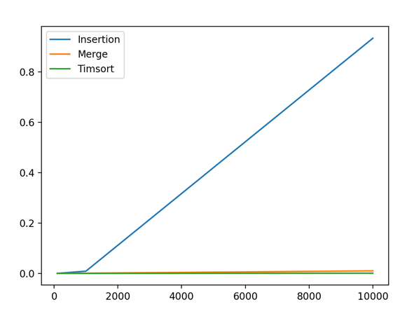

# goit-algo-hw-04

В цій практичній роботі ми порівнювали швидкість алгоритмів сортування,
а саме методи вставки, злиття і стандартний для Пайтон тімсорт. В таблиці 
наведені результати сортування списку різної довжини, який було згенеровано
випадково:

| Алгоритм    | 100 елементів | 1000 елементів | 10000 елементів |
|-------------|---------------|----------------|-----------------|
| вставка     | 0.00017       | 0.018          | 1.83            |
| злиття      | 0.00012       | 0.0016         | 0.02            |
| тімсорт     | 0.0000055     | 0.000072       | 0.00093         |

Як бачимо, різниця колосальна. Найповільнішим є алгоритм вставки, а найшвидшим
тімсорт. Далі буде аналогічна таблиця, але у відносних значеннях.

| Алгоритм    | 100 елементів | 1000 елементів | 10000 елементів |
|-------------|---------------|----------------|-----------------|
| вставка     | 30            | 244            | 2007            |
| злиття      | 22            | 21             | 22              |
| тімсорт     | 1             | 1              | 1               |

У той час як злиття і тімсорт показують зріст близький до лінійного
(кожний експеримент відповідає х10 кількості чисел, і час виконання збільшується 
приблизно у 10 разів), то вставка показує квадратичний зріст (х100 часу на х10 
розміру). 

Таким чином, зі збільшенням розміру списку, вибір вставки замість стандартного 
тімсорту виливається в збільшення часу в квадратичному розмірі. На 100 це у 30 разів
повільніше, на 1000 у 244, а на 10000 - 2007.
Злиття на інтервалі 100-10000 працює стабільно в 21-22 рази повільніше за тімсорт.

